# Dog Watch — Smart IoT Dog Feeder

**Embedded Systems · FreeRTOS · IoT · Cloud Integration**
**Authors:** Kiet Cao, Andrew Katz

## Overview

Dog Watch is a network-connected smart dog feeder built on an ATSAMW25 (SAMD21 + WINC1500) running FreeRTOS.
It measures food level with an 8-point VEML7700 + TCA9548A I2C mux sensor array, monitors tank and bowl water status using ADC + float sensing, and tracks device tilt using an LSM6DSOX IMU.

The device publishes telemetry and events over MQTT and receives commands in real time from a Node-RED dashboard hosted on Azure.
Users can trigger food dispensing (single-rotation control using a magnetic position switch) and water dispensing (pump cutoff based on bowl water detection). The main PCB also controls an RP2040 camera and audio module over UART for snapshot capture and audio prompts.

The project emphasizes reliable FreeRTOS task design, interrupt-driven drivers, and system bring-up/debug across firmware and PCB hardware under tight MCU memory limits.

## Video Demonstration

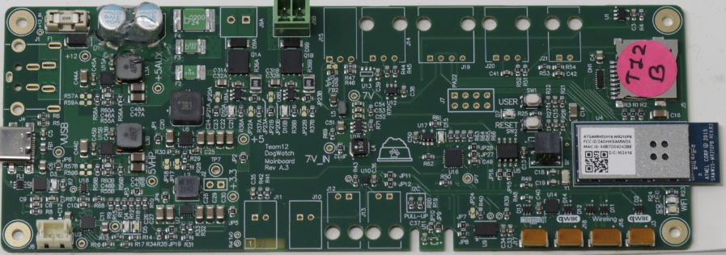

**Final Version (with image and audio features):**
https://drive.google.com/file/d/18tD0LWCVBPJNzHUb0mOsfyb1iBhmIJxS/view?usp=sharing

## System Architecture

### Core Controller

- **ATSAMW25 (SAMD21 + WINC1500)**
  - Runs FreeRTOS
  - Manages sensing, actuation, MQTT communication, and CLI
  - Task synchronization via queues and semaphores

### Communication

- Wi-Fi (WINC1500) for cloud connectivity
- MQTT for telemetry and command handling
- Node-RED dashboard hosted on Azure

## What We Built

### Embedded Firmware

- Designed a task-based FreeRTOS architecture for sensors, motor, pump, MQTT, and CLI.
- Consolidated functionality into six primary tasks to reduce stack pressure:
  - motor, pump, Wi-Fi, MQTT send, ADC/IMU, CLI
- Routed all outgoing data through a single MQTT send task using a queue.

### Cloud Interface

- Implemented full MQTT publish/subscribe flow.
- Built a Node-RED UI for real-time monitoring and control.
- Verified end-to-end command latency below 5 seconds.

## Sensors and Actuators

### Sensors

- **Food level:** 8× VEML7700 ambient light sensors arranged vertically inside the hopper and read through a TCA9548A I2C multiplexer.Food percentage is estimated from the number of sensors covered by food.

  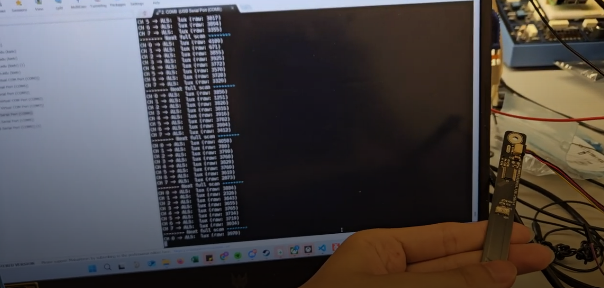
- **Water monitoring:**

  - Analog water level sensor (ADC)
  - Float sensor in bowl to stop pump when full
- **Tilt detection:** LSM6DSOX IMU used for x/y/z acceleration and tamper detection.
- **Additional sensors (in progress):**

  - Temperature & humidity (SHT40)
  - Proximity / distance sensor
  - Tamper switch
  - Dog request button
- **Magnetic switch:**
  Detects dispensing wheel position to stop the motor after one full rotation.

### Actuators

- **DC motor:** food dispensing with rotation feedback
- **Peristaltic pump:** water refill with float-based cutoff
- **Audio module (RP2040):** plays recorded prompts (UART integrated in Final Version)
- **Camera module (RP2040):** captures images locally (UART integrated in Final Version)

## Block Diagram

## Key Engineering Challenges

### SD Card Hardware Failure

The SD card on the main PCB failed due to the **CLK line being grounded**.
After firmware checks and oscilloscope probing, the issue was traced to PCB assembly.
A second PCB worked correctly, confirming the root cause.

### FreeRTOS Stack Pressure

Initial integration caused stack overflows due to many concurrent drivers.The solution was to:

- Merge drivers into fewer tasks
- Use semaphores for activation
- Centralize MQTT publishing

This stabilized execution and reduced memory usage.

### I2C Integration

Five I2C peripherals were present.
Core sensors were fully validated, while non-critical components were deferred due to time constraints.

## Validation Highlights

- **Food sensing:** consistent separation between covered and uncovered states
- **Motor control:** repeatable single-rotation dispensing using magnetic feedback
- **Remote control:** verified real-time MQTT command execution

## Project Photos & Screenshots

### Standalone PCBA — Top

### Before Soldering

### Standalone PCBA — Bottom

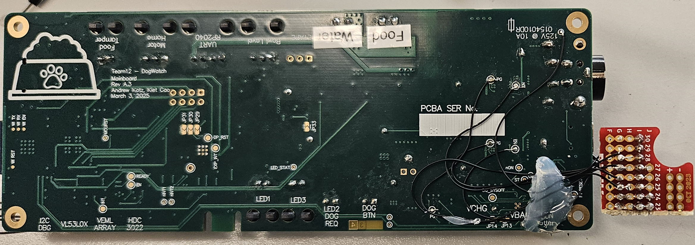

### Thermal Imaging (Under Load)

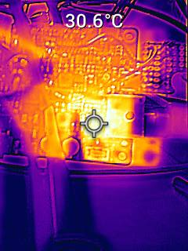
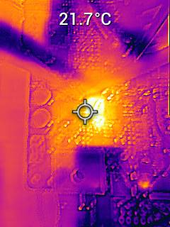

### PCB Design (Altium)

**2D View:**
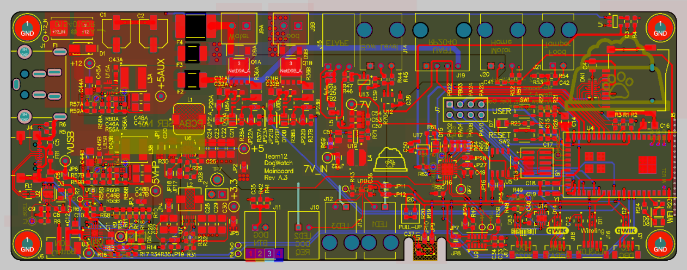

**3D View:**
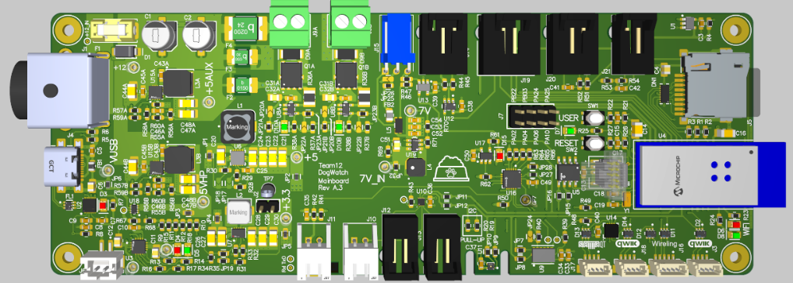

### Node-RED Dashboard

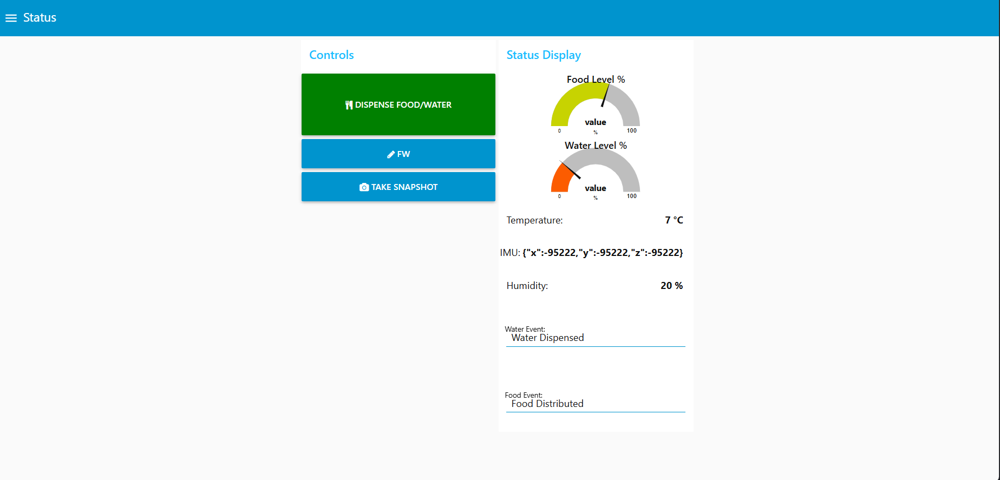

### Node-RED Backend

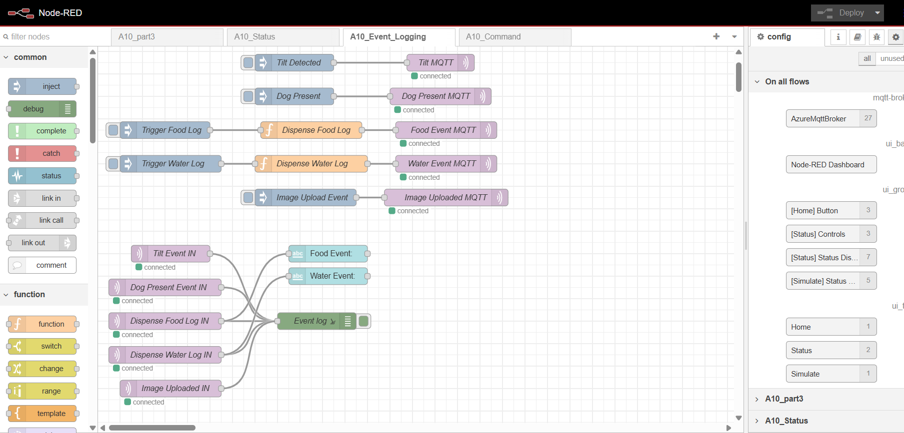
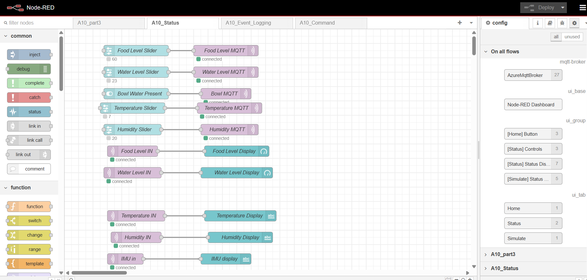
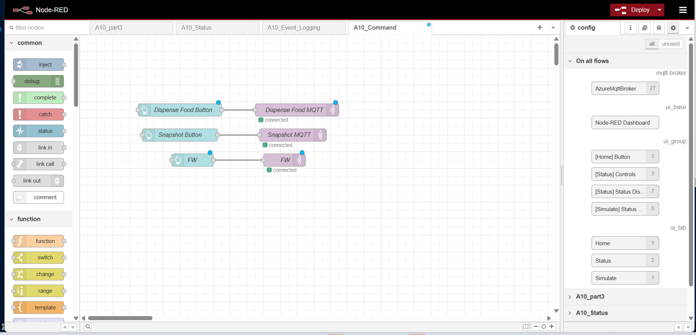

### Extra PCB — Light Sensor Array

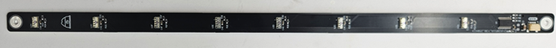
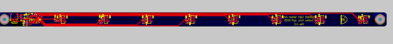
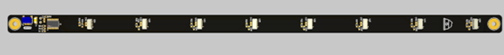

## Codebase

> Note: Two firmware builds exist (non-SD main PCB and SD-enabled second PCB).
> Code may not be public due to course policy.

- **Application:**https://github.com/ese5160/final-project-t12-andrew-and-kiet/tree/main/Application
- **Bootloader:**https://github.com/ese5160/final-project-t12-andrew-and-kiet/tree/main/Bootloader
- **Node-RED:**https://github.com/ese5160/final-project-t12-andrew-and-kiet/tree/main/Node-Red
- **Other Software:**
  https://github.com/ese5160/final-project-t12-andrew-and-kiet/tree/main/avboard

## Skills Demonstrated

### Embedded Systems

- FreeRTOS task design, queues, semaphores, stack/heap debugging
- I2C, ADC, GPIO interrupt-driven drivers
- Motor and pump control with sensor-based safety logic

### IoT & Cloud

- MQTT telemetry and command handling
- Node-RED dashboard integration on Azure

### Hardware Bring-up

- Board-level debugging and oscilloscope analysis
- Firmware–hardware fault isolation
- Iterative prototyping and validation

## Next Steps

- Clean up and document UART-based RP2040 integration (camera and audio now working in Final Version)
- Add RTC-based scheduling for feeding and watering
- Finalize enclosure for water resistance and tamper safety
- Rework SD card PCB issue (re-solder or re-spin)
